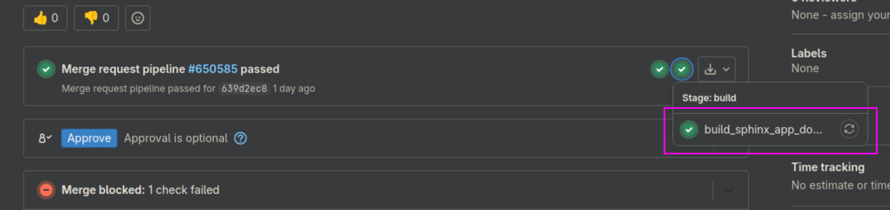

# Using this documentation

This documentation is made with Sphinx using [MyST Markdown](https://myst-parser.readthedocs.io/en/latest/index.html).

It is published to https://kde-builder.kde.org

## Preview the documentation in Merge Requests

When making changes to the documentation, and pushing your commits to gitlab, you can preview the rendered documentation using
artifacts of _build_sphinx_app_docs_ job.



Select the job, then in its page in the right pane, in the "Job artifacts" press "Browse".
Then navigate to the path `public/en/index.html` and click on it.

## Building documentation locally

You can run the `scripts/build_docs.sh` script to build documentation. Then navigate to `doc/_build/html/index.html` and open it.

If you want to work on documentation, you would like to use live preview. Run this command in terminal:

```bash
sphinx-autobuild doc doc/_build/html
```

It will launch a local web server, and watch if changes are made to files. Click on the link it prints, this will open the `index.html`
in your browser. When sphinx-autobuild detects changes in files, it will automatically rebuild documentation, and refresh the page in
browser.
